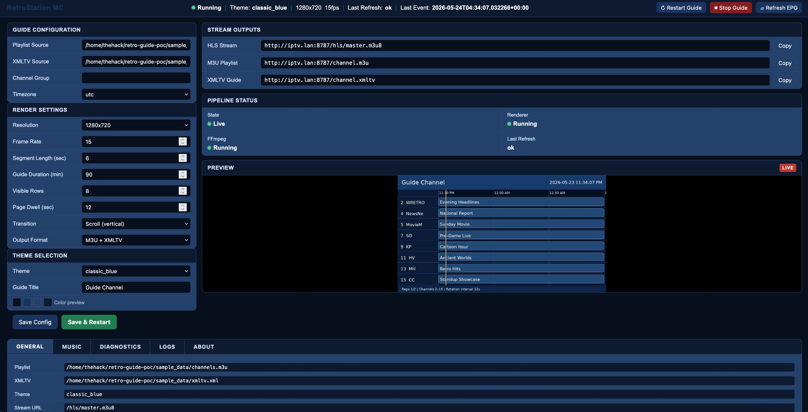

# RetroStation MC

<p align="center">
  <a href="https://github.com/thehack904/RetroStation_MC">
    
  </a>
  <a href="https://creativecommons.org/licenses/by-nc-sa/4.0/">
    
  </a>
</p>
<p align="center">
  
</p>

RetroStation MC is an admin-driven retro TV guide channel generator. It ingests an M3U playlist and XMLTV guide data, renders a continuous guide-style video feed, packages that feed as HLS, and exposes a single-channel M3U/XMLTV pair for use in RetroIPTVGuide or another IPTV client.

This repository is versioned as **v1.0.0**.

## What it does

RetroStation MC turns guide metadata into a playable channel:

```text
M3U playlist + XMLTV EPG
        ↓
Flask admin and worker process
        ↓
data/guide_state.json
        ↓
Python/Pillow renderer emits raw RGB frames
        ↓
FFmpeg encodes H.264/AAC and writes HLS segments
        ↓
/hls/master.m3u8 + /channel.m3u + /channel.xmltv
```

The output is designed to behave like a live virtual TV channel. The app renders a guide grid, rotates through pages of channels, keeps a clock/current-time marker active, and provides a standby stream while the live guide is warming up.

## Key features

- Flask-based local admin dashboard
- SQLite-backed settings and application event log
- Local file path or HTTP/HTTPS M3U playlist input
- Local file path or HTTP/HTTPS XMLTV input
- Built-in single-channel M3U and XMLTV outputs
- HLS master playlist with standby-to-live switching
- FFmpeg H.264 video and AAC audio output
- Silent AAC track by default for IPTV client compatibility
- Optional background music upload and selection
- Theme selection using JSON theme files
- 720p and 1080p render profiles
- Cut or vertical scroll page transitions
- Diagnostics controls for HLS live-edge delay and buffer thresholds
- JSONL/CSV log export
- Docker and Docker Compose support
- Bundled sample M3U/XMLTV data

## Local-only security model

RetroStation MC v1.0.0 has **no authentication**. Do not expose it directly to the public internet. Run it on a trusted LAN, behind a VPN, or behind an authenticated reverse proxy.

## Quick start with Docker Compose

```bash
docker compose up --build
```

Open:

- Admin UI: `http://localhost:8787/`
- HLS master playlist: `http://localhost:8787/hls/master.m3u8`
- Single-channel M3U: `http://localhost:8787/channel.m3u`
- Virtual channel XMLTV: `http://localhost:8787/channel.xmltv`

## Quick start with Python


Requirements:

- Python 3.11 or newer
- FFmpeg in `PATH`

```bash
./install-linux.sh
```

Or run the setup steps manually:


```bash
python3 -m venv .venv
source .venv/bin/activate
pip install -r requirements.txt
python app.py
```

Then open `http://localhost:8787/`.

## Recommended integration path

For RetroIPTVGuide, add the RetroStation MC playlist endpoint as a tuner/source:

```text
http://YOUR_SERVER:8787/channel.m3u
```

That playlist contains one virtual channel. The stream URL points to `/hls/master.m3u8`, and the EPG URL points to `/channel.xmltv`.

## Documentation

Start here:

- [Documentation Index](docs/INDEX.md)
- [Installation](docs/INSTALLATION.md)
- [Configuration Reference](docs/CONFIGURATION.md)
- [Admin User Guide](docs/ADMIN_USER_GUIDE.md)
- [RetroIPTVGuide Integration](docs/RETROIPTVGUIDE_INTEGRATION.md)
- [Architecture](docs/ARCHITECTURE.md)
- [HLS Pipeline](docs/HLS_PIPELINE.md)
- [Troubleshooting](docs/TROUBLESHOOTING.md)

## Runtime directories

| Path | Purpose |
|---|---|
| `data/config.db` | SQLite settings and event log database |
| `data/guide_state.json` | Normalized renderer state generated from M3U/XMLTV |
| `data/music/` | Uploaded background music files |
| `data/renderer.pid` | Renderer process PID used for reattach/restart logic |
| `data/ffmpeg.pid` | FFmpeg process PID used for reattach/restart logic |
| `output/guide.m3u8` | Live HLS media playlist written by FFmpeg |
| `output/guide_*.ts` | Live MPEG-TS HLS segments |
| `output/standby.ts` | Generated standby segment |
| `sample_data/` | Bundled sample M3U/XMLTV input files |

## Default ports and environment variables

| Setting | Default |
|---|---:|
| Web port | `8787` |
| Host bind | `0.0.0.0` |
| `RETROGUIDE_HOST` | `0.0.0.0` |
| `RETROGUIDE_PORT` | `8787` |
| `RETRO_TELEMETRY_DEBUG` | disabled |

## Project status

v1.0.0 is a functional first release. The renderer is intentionally Python/Pillow-based so the rest of the application flow can be validated before replacing the renderer with a lower-level implementation such as SDL, C, Rust, or another real-time rendering stack.
