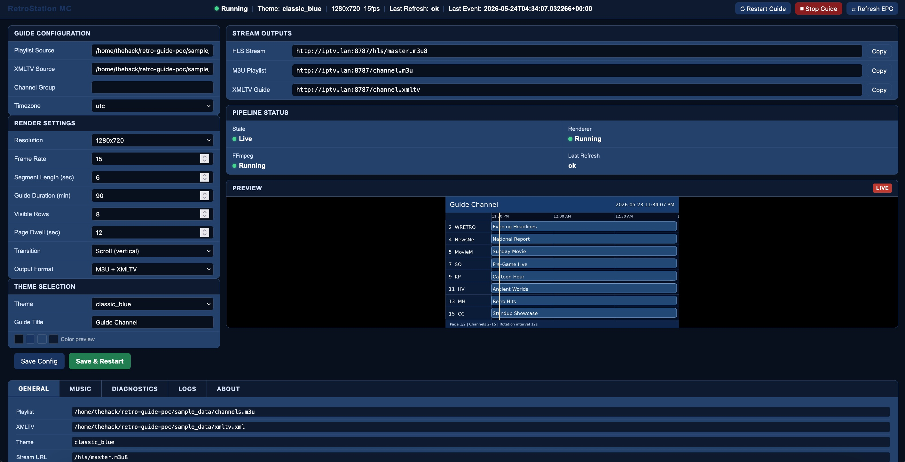

# RetroStation MC

<p align="center">
  <a href="https://github.com/thehack904/RetroStation_MC">
    
  </a>
  <a href="https://creativecommons.org/licenses/by-nc-sa/4.0/">
    
  </a>
</p>
<p align="center">
  
</p>

RetroStation MC is an admin-driven retro TV guide channel generator. It ingests an M3U playlist and XMLTV guide data, renders a continuous guide-style video feed, packages that feed as HLS, and exposes M3U/XMLTV outputs for use in RetroIPTVGuide or another IPTV client.

This repository is versioned as **v1.5.0 Beta 1**.

## What it does

RetroStation MC turns guide metadata into a playable channel:

```text
M3U playlist + XMLTV EPG
        ↓
Flask admin and worker process
        ↓
data/guide_state.json
        ↓
Python/Pillow renderer emits raw RGB frames
        ↓
FFmpeg encodes H.264/AAC and writes HLS segments
        ↓
/hls/master.m3u8 + /channel.m3u + /channel.xmltv
```

The output is designed to behave like a live virtual TV channel. The app renders a guide grid, rotates through pages of channels, keeps a clock/current-time marker active, and provides a standby stream while the live guide is warming up.

## Key features

- Flask-based local admin dashboard
- SQLite-backed settings and application event log
- Local file path or HTTP/HTTPS M3U playlist input
- Local file path or HTTP/HTTPS XMLTV input
- Built-in M3U and XMLTV outputs for the guide plus enabled virtual channels
- HLS master playlist with standby-to-live switching
- FFmpeg H.264 video and AAC audio output
- Hardware acceleration auto-selection with software fallback
- Silent AAC track by default for IPTV client compatibility
- Optional background music upload and selection
- Optional Weather virtual channel with dedicated HLS output
- Guide and Weather logo metadata for exported playlists
- Theme selection using JSON theme files
- Optional classic cable-guide video preview window with automatic HLS/MPEG-TS/local-file input detection, source-keyed transport caching, and Guide / Preview / Silent audio modes
- Transport-aware Guide Preview processing: dedicated MPEG-TS relay/overlay path plus normalized HLS/local-file frame and audio handling
- Rotating Guide Message blocks with explicit multiline `[message]` syntax, timed blank intervals, and automatic Now Playing text when Preview is tuned to a real channel
- Widescreen and standard 4:3 render profiles: 1280x720, 1920x1080, 960x720, and 1440x1080
- Optional secondary Guide output with a native SD renderer at 720x480 (default), 640x480, or 960x720; exported automatically through the normal M3U/XMLTV channel list
- Cut or vertical scroll page transitions
- Standby pattern uploads with selectable custom artwork and overlay controls
- Daily off-air scheduling with optional static-noise playback
- Diagnostics controls for HLS live-edge delay and buffer thresholds
- JSONL/CSV log export
- Docker and Docker Compose support
- Bundled sample M3U/XMLTV data

## Local-only security model

RetroStation MC v1.5.0 Beta 1 has **no authentication**. Do not expose it directly to the public internet. Run it on a trusted LAN, behind a VPN, or behind an authenticated reverse proxy.

## Quick start with Docker Compose

```bash
docker compose up --build
```

Open:

- Admin UI: `http://localhost:8787/`
- HLS master playlist: `http://localhost:8787/hls/master.m3u8`
- Single-channel M3U: `http://localhost:8787/channel.m3u`
- Virtual channel XMLTV: `http://localhost:8787/channel.xmltv`
- HDHomeRun-matched XMLTV: `http://localhost:8787/hdhr/guide.xml` (use this with Plex after adding the RSMC tuner)

## Quick start with Python


Requirements:

- Python 3.11 through 3.14 (the Linux installer automatically selects the newest supported interpreter installed)
- FFmpeg in `PATH`

```bash
sudo ./retrostation_linux.sh install
```

The installer creates a dedicated `retrostation-mc` system user and installs the application under `/opt/retrostation-mc`.
Administrator-managed service configuration lives under `/etc/retrostation-mc`, and mutable state lives under `/var/lib/retrostation-mc`.
It also creates and starts the `retrostation-mc` systemd service.
During installation it runs `gpu_hwaccel_detect_v3.py` to report whether hardware acceleration is ready.
If a legacy `/home/iptv/retrostation-mc` install is found, the installer runs a restartable migration with backups in `/var/backups/retrostation-mc`, state/config migration into `/var/lib/retrostation-mc` and `/etc/retrostation-mc`, and progress markers in `/var/lib/retrostation-mc/.migration` before switching the service to `/opt/retrostation-mc`.

Installed Linux layout:

| Path | Owner / write model | Purpose |
|---|---|---|
| `/opt/retrostation-mc` | root-managed application tree | code, bundled assets, and virtual environment |
| `/etc/retrostation-mc` | `root:root` | administrator-managed service configuration |
| `/etc/retrostation-mc/retrostation-mc.conf` | `root:root`, mode `0644` | environment overrides loaded by systemd |
| `/var/lib/retrostation-mc` | `retrostation-mc:retrostation-mc` | database, generated state, HLS output, runtime files |
| `/var/lib/retrostation-mc/.migration` | root-managed metadata | restart markers for interrupted legacy migrations |
| `/var/backups/retrostation-mc` | root-managed backups | automatic legacy-layout rollback material |

The generated systemd unit runs as `retrostation-mc`, keeps `ProtectSystem=full`, and grants write access only to `/var/lib/retrostation-mc` through `ReadWritePaths`.
When the host already has `video` and/or `render` groups, the installer adds `retrostation-mc` to them so VA-API/QSV can access `/dev/dri` without changing ownership of the application tree.

```bash
sudo systemctl status retrostation-mc
```

### Upgrade from `/home/iptv/retrostation-mc`

Run the same installer command:

```bash
sudo ./retrostation_linux.sh install
```

Migration is automatic when the legacy tree is detected. The installer:

1. Backs up the old unit, service environment, and mutable trees under `/var/backups/retrostation-mc/...`.
2. Copies legacy config into `/etc/retrostation-mc/legacy/` and state into `/var/lib/retrostation-mc` without overwriting already-migrated files.
3. Records restartable progress markers under `/var/lib/retrostation-mc/.migration`.
4. Leaves `/home/iptv/retrostation-mc` in place so cleanup stays an explicit follow-up decision.

If installation is interrupted, run `sudo ./retrostation_linux.sh install` again; the same backup directory and migration markers are reused.

### Backup, rollback, and removal

- Fresh automatic migration backups are written below `/var/backups/retrostation-mc`.
- Each migration backup includes `rollback.txt` with the legacy-unit restore sequence.
- To verify an upgraded install, check `sudo systemctl status retrostation-mc`, `sudo journalctl -u retrostation-mc -n 100 --no-pager`, and confirm the active unit points at `/opt/retrostation-mc`.
- To roll back, stop the current service, restore the backed-up legacy unit/configuration noted in `rollback.txt`, and restart `retrostation-mc` against `/home/iptv/retrostation-mc`.

To remove the service and application files while preserving `/etc/retrostation-mc` and `/var/lib/retrostation-mc`:

```bash
sudo ./retrostation_linux.sh uninstall
```

To also purge the dedicated configuration/state directories and remove the dedicated `retrostation-mc` account when it is no longer in use:

```bash
sudo ./retrostation_linux.sh uninstall --purge
```

`uninstall` is the safe default for host rebuilds and troubleshooting because it preserves configuration, database/state, and migration metadata. `uninstall --purge` additionally removes `/etc/retrostation-mc`, `/var/lib/retrostation-mc`, and the dedicated `retrostation-mc` account when no running processes or project-owned files still depend on it.

### Service operations and troubleshooting

```bash
sudo systemctl status retrostation-mc
sudo systemctl restart retrostation-mc
sudo systemctl stop retrostation-mc
sudo systemctl start retrostation-mc
sudo systemctl is-active retrostation-mc
sudo systemctl is-enabled retrostation-mc
sudo journalctl -u retrostation-mc -n 100 --no-pager
sudo journalctl -u retrostation-mc -f
```

The managed unit file lives at `/etc/systemd/system/retrostation-mc.service`.

### Coexistence with RetroStation Player and sibling projects

RetroStation MC now uses its own Linux service name, account, configuration tree, state tree, and backup root. That separation is intentional so it can coexist on the same host with RetroStation Player, RetroIPTVGuide, and other sibling services without sharing `/home/iptv` ownership or stopping/removing unrelated units.

Or run the setup steps manually:


```bash
python3 -m venv .venv  # use Python 3.11-3.14
source .venv/bin/activate
pip install -r requirements.txt
python app.py
```

Then open `http://localhost:8787/`.

## Recommended integration path

For RetroIPTVGuide, add the RetroStation MC playlist endpoint as a tuner/source:

```text
http://YOUR_SERVER:8787/channel.m3u
```

That playlist always contains the guide channel and can also include enabled virtual channels such as Weather. The guide entry points to `/hls/master.m3u8`, and the EPG URL is `/channel.xmltv`.

## Documentation

Start here:

- [Documentation Index](docs/INDEX.md)
- [Installation](docs/INSTALLATION.md)
- [Configuration Reference](docs/CONFIGURATION.md)
- [Admin User Guide](docs/ADMIN_USER_GUIDE.md)
- [RetroIPTVGuide Integration](docs/RETROIPTVGUIDE_INTEGRATION.md)
- [Architecture](docs/ARCHITECTURE.md)
- [HLS Pipeline](docs/HLS_PIPELINE.md)
- [Troubleshooting](docs/TROUBLESHOOTING.md)

## Runtime directories

| Path | Purpose |
|---|---|
| `data/config.db` | SQLite settings and event log database |
| `data/guide_state.json` | Normalized renderer state generated from M3U/XMLTV |
| `data/music/` | Uploaded background music files |
| `data/weather_music/` | Uploaded Weather channel background music files |
| `data/renderer.pid` | Renderer process PID used for reattach/restart logic |
| `data/ffmpeg.pid` | FFmpeg process PID used for reattach/restart logic |
| `output/guide.m3u8` | Live HLS media playlist written by FFmpeg |
| `output/guide_*.ts` | Live MPEG-TS HLS segments |
| `output/standby.ts` | Generated standby segment |
| `output/static.ts` | Generated static-noise segment used by off-air mode when enabled |
| `output/weather.m3u8` | Weather virtual channel HLS media playlist |
| `output/weather_*.ts` | Weather virtual channel MPEG-TS HLS segments |
| `sample_data/` | Bundled sample M3U/XMLTV input files |

## Default ports and environment variables

| Setting | Default |
|---|---:|
| Web port | `8787` |
| Host bind | `0.0.0.0` |
| `RETROGUIDE_HOST` | `0.0.0.0` |
| `RETROGUIDE_PORT` | `8787` |
| `RETRO_TELEMETRY_DEBUG` | disabled |

## Project status

The renderer is intentionally Python/Pillow-based so the rest of the application flow can be validated before replacing the renderer with a lower-level implementation such as SDL, C, Rust, or another real-time rendering stack.

### Plex XMLTV mapping

When using the RSMC HDHomeRun tuner with Plex, use `/hdhr/guide.xml` as the XMLTV guide URL. This output is generated from the same effective channel set as `/lineup.json`: RSMC-owned channels are included automatically and imported source channels appear only when selected for rebroadcast. For selected imported channels, RSMC carries through matching programme data from the configured upstream XMLTV source when available.

If Plex cannot fetch the guide when a `.lan` or `.local` hostname is used, enter the RSMC server's LAN IP instead (for example `http://192.0.2.191:8787/hdhr/guide.xml`) so guide retrieval does not depend on the Plex host resolving local DNS names.


### Plex Live TV playback note

If Plex can discover the RSMC tuner and complete guide mapping but playback fails with a generic tuner/source unavailable error, check **Settings → Server → Transcoder** in Plex and make sure **Disable video stream transcoding** is **unchecked**. Plex may still decide that Live TV playback requires a transcode/remux step even when the incoming RSMC tuner stream is already H.264/AAC in MPEG-TS.


## HDHomeRun Input output modes

The v1.5.0 Beta 1 **HDHomeRun Input** tab configures physical tuner discovery, channel selection, rendered-Guide inclusion, and rebroadcast. The compact channel table supports search, All/Used/Rebroadcast/Unused filtering, fixed-height scrolling, sticky headers, counts, and independent bulk selection for **Use** and **Rebroadcast**. The selected Output Mode controls how rebroadcast channels are delivered. Continuous MPEG-TS bypasses HLS segmentation and uses the same source-aware codec/deinterlace/hardware-acceleration policy as the HLS test path.

The optional **Include selected physical channels in the RetroStation MC Guide** setting merges only channels checked under **Use** into the rendered Guide. This does not replace Playlist Source or XMLTV Source and does not change the validated tuner transport path. When SiliconDust XMLTV data is available, current and future programme titles, times, and descriptions are mapped to those physical channel rows. If guide retrieval is temporarily unavailable, the selected channel remains visible with a programming-unavailable fallback entry.

Discover/Refresh also uses the HDHomeRun `DeviceAuth` to retrieve SiliconDust XMLTV channel metadata. When available, RSMC imports the official station icon and XMLTV channel id, exposes the icon through a stable `/hdhomerun-testing/logo/<channel-key>` proxy URL, and emits it as `tvg-logo` in the testing M3U. Artwork lookup is optional and does not block local lineup discovery when the SiliconDust guide service is unavailable.


### HDHomeRun artwork fallback
If SiliconDust does not provide a channel logo, or the official artwork server is temporarily unavailable, RSMC serves a generated local fallback logo from the same stable channel-logo endpoint.


### HDHomeRun diagnostics

### Shared physical tuner sessions

Physical HDHomeRun stations are shared inside RSMC. Guide Preview, HLS rebroadcast, continuous MPEG-TS rebroadcast, raw passthrough, and diagnostic consumers of the same station attach to one internal localhost MPEG-TS relay, so they consume one physical tuner rather than opening duplicate SiliconDust streams. The existing HDHomeRun idle-timeout setting acts as a warm grace period after the final consumer disconnects, allowing quick Guide-to-channel handoffs. Different simultaneously active stations still consume separate tuners and are limited by the tuner count reported by the device. HLS clients share the existing per-channel HLS output session; individual playlist and segment HTTP requests do not count as physical tuner consumers.

Per-channel stream inspection has moved to **Diagnostics → HDHomeRun Diagnostics**. Choose one discovered channel from the dropdown to view its tuner metadata and direct HLS, MPEG-TS, and raw transport test URLs. A channel must be enabled under **HDHomeRun Input → Use** before direct stream tests are available.

### Combined channel export

The public `channel.m3u` / `channel.m3u8` and `channel.xmltv` endpoints can aggregate three channel families into one downstream lineup:

- the configured Playlist Source + XMLTV Source when **Source Channel Export** is enabled;
- enabled RSMC Virtual Channels when Virtual Channel Export is enabled;
- physical HDHomeRun channels explicitly marked **Rebroadcast**.

Imported Playlist Source streams keep their existing stream URLs and are not needlessly transcoded. RSMC assigns stable `rsmc-source-*` IDs and remaps the configured XMLTV programme rows to those IDs so M3U/XMLTV matching remains collision-safe.

